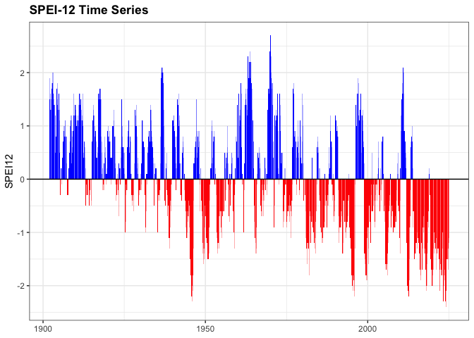
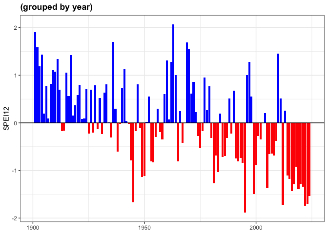
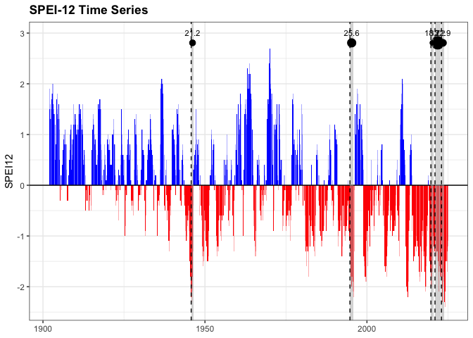

<!-- README.md is generated from README.Rmd. Please edit that file -->

# droughtevents

<!-- badges: start -->

<!-- [](https://github.com/ajpelu/droughtevents/actions/workflows/R-CMD-check.yaml) -->

<!-- [](https://app.codecov.io/gh/ajpelu/droughtevents?branch=main) -->

<!-- badges: end -->

## Overview

`droughtevents` provides tools to detect, summarize, and visualize
drought events from drought-related index time series (e.g., SPEI, SPI).
Given a time series and a threshold, the package identifies periods of
sustained below-threshold values, computes summary statistics for each
event (duration, intensity, severity, timing), and offers
`ggplot2`-based plotting functions to visualize the time series and
highlight the detected events.

## Installation

You can install the development version of `droughtevents` from
[GitHub](https://github.com/) with:

``` r
# install.packages("remotes")
remotes::install_github("ajpelu/droughtevents")
```

## Usage

``` r
library(droughtevents)
library(ggplot2)
```

### Detect drought events

`droughts()` identifies drought events in a time series when a given
index falls below a specified threshold for at least `min_duration`
consecutive months (2 by default).

``` r
data(spei_granada)

result <- droughts(spei_granada, vname = "spei12", threshold = -1.28)

result$drought_assessment
#> # A tibble: 17 × 9
#>    index_events d_duration d_intensity d_severity lowest_spei month_peak minyear
#>           <int>      <dbl>       <dbl>      <dbl>       <dbl>      <dbl>   <dbl>
#>  1            3         11       -1.93       21.2        -2.3         10    1945
#>  2            5          4       -1.45        5.8        -1.6          5    1949
#>  3            7          2       -1.45        2.9        -1.5         12    1950
#>  4           11          2       -1.35        2.7        -1.4          6    1965
#>  5           21         14       -1.83       25.6        -2.2         10    1994
#>  6           23          9       -1.63       14.7        -1.9          6    1998
#>  7           27          7       -1.64       11.5        -1.7          7    2005
#>  8           29          9       -1.92       17.3        -2.2          8    2012
#>  9           31          5       -1.38        6.9        -1.5          5    2014
#> 10           33          5       -1.64        8.2        -1.9          3    2015
#> 11           35          3       -1.5         4.5        -1.7         10    2016
#> 12           37         11       -1.6        17.6        -2.1         12    2017
#> 13           39         11       -1.7        18.7        -2           10    2019
#> 14           41          2       -1.5         3          -1.7         12    2020
#> 15           43         21       -1.58       33.2        -2.1          1    2021
#> 16           45         12       -1.91       22.9        -2.4          1    2023
#> 17           47          5       -1.54        7.7        -1.7          9    2024
#> # ℹ 2 more variables: maxyear <dbl>, rangeDate <chr>
```

The returned object is a named list with three elements:

- `data`: the original data, with drought flags and durations added.
- `drought_events`: only the rows that belong to a detected drought
  event.
- `drought_assessment`: one row per event, with its duration, intensity,
  severity, and timing.

### Plot the time series

`plot_drought_ts()` draws the index as a bar plot, coloring positive
(wet) and negative (dry) periods differently.

``` r
plot_drought_ts(spei_granada, vname = "spei12", title = "SPEI-12 Time Series")
```



You can also aggregate by year:

``` r
plot_drought_ts(spei_granada, vname = "spei12", by_year = TRUE)
```



### Highlight drought events on the plot

`add_drought_events()` overlays the detected events on top of a plot
created with `plot_drought_ts()`, as shaded bands, vertical lines, or
both, optionally showing severity labels.

``` r
p <- plot_drought_ts(spei_granada, vname = "spei12", title = "SPEI-12 Time Series")

p |>
  add_drought_events(
    drought_assessment = result$drought_assessment,
    which_events = "top",
    metric = "severity",
    top_n = 5,
    type = "both",
    show_severity = TRUE
  )
```



## Data

The package ships with `spei_granada`, a monthly SPEI time series (6,
12, 24, and 48-month scales) for Granada, Spain, covering 1901-2024. See
`?spei_granada` for details and the data source.

## References

Vicente-Serrano, S.M., Beguería, S., López-Moreno, J.I. (2010). A
Multiscalar Drought Index Sensitive to Global Warming: The Standardized
Precipitation Evapotranspiration Index. *Journal of Climate*, 23(7),
1696-1718. <https://doi.org/10.1175/2009JCLI2909.1>

## License

<!-- Add your license here, e.g. MIT, GPL-3 -->
